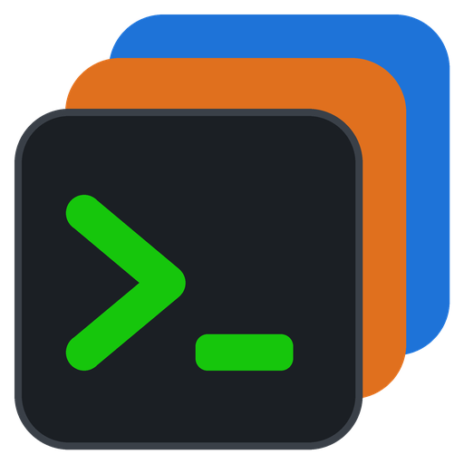

<p align="center">
  
</p>

<h1 align="center">TermDeck</h1>

A MobaXterm-style Windows app for running command-line tools per project. Add Windows executables or WSL
commands as tools, group them into collections, and run each in its own terminal tab. Every run — command,
exit code and full colored output — is saved in the project folder so you can reopen it later.

## Install

Download from the [latest release](../../releases/latest):

- **`TermDeck-Setup-<version>.exe`** — installer (choose *Install for me only* if you don't have admin rights).
- **`TermDeck-<version>-portable-win-x64.zip`** — portable: unzip and run `TermDeck.exe`.

Requires Windows 10 1809+ or Windows 11 (x64). WSL is only needed for Linux tools.

## Build

Needs the .NET 10 SDK and [Inno Setup 6](https://jrsoftware.org/isinfo.php) (`winget install JRSoftware.InnoSetup`):

```powershell
powershell -ExecutionPolicy Bypass -File build-release.ps1
```

The installer and portable zip are written to `dist\release\`.
